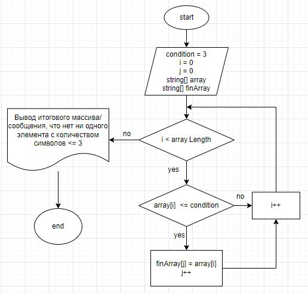

# Итоговая проверочная работа.
## Задача:
Написать программу, которая из имеющегося массива строк формирует массив из строк, длина которых меньше либо равна 3 символа. Первоначальный массив можно ввести с клавиатуры либо задать на старте выполнения алгоритма. При решении не рекомендуется пользоваться коллекциями, лучше обойтись исключительно массивами.

**Примеры:**

*[“Hello”, “2”, “world”, “:-)”] → [“2”, “:-)”]*

*[“1234”, “1567”, “-2”, “computer science”] → [“-2”]*

*[“Russia”, “Denmark”, “Kazan”] → []*

## Блок-схема алгоритма:

## Описание алгоритма решения задачи.

1. Пользователь выбирает как хочет вводить данные: вручную или случайным образом.

2. Пользователь вводит желаемое количество строк.

3. Пользователь вводит строки по очереди через Enter / строки формируются случайным образом.

4. Формируем изначальный массив.

5. Заполняем массив (*с помощью метода FillArray()*).

6. Выводим заполненный массив на экран (*с помощью метода PrintArray()*).

7. Определяем длину итогового массива: проверяем по очереди каждый элемент массива на соответствие условию: длина элемента <= 3 (*с помощью метода FindFinalArrayLength()*).

8. Если условие выполняется, то элемент из изначального массива кладём в итоговый массив (*с помощью метода MoveElements()*).

9.  Повторяем пункты 7-8 до тех пор, пока не дойдём до конца изначального массива.

10. Возращаем новый заполненый массив как результат / выводим сообщение: "Нет элементов с количеством символов <= 3".

## Код решения задачи.
Можно найти в папке Task в файле Program.cs.